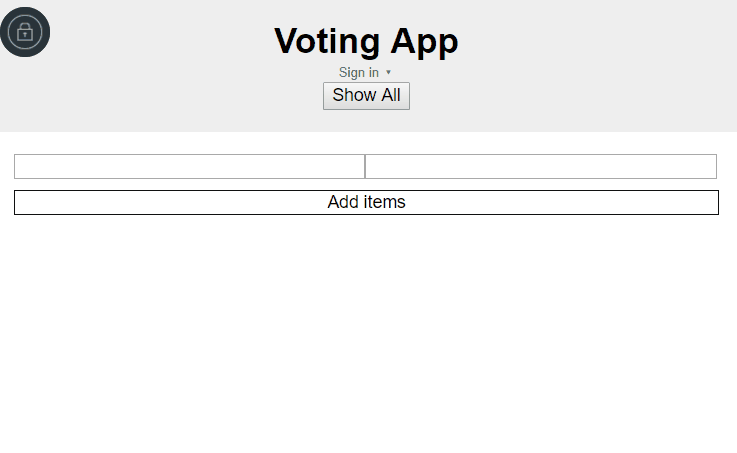
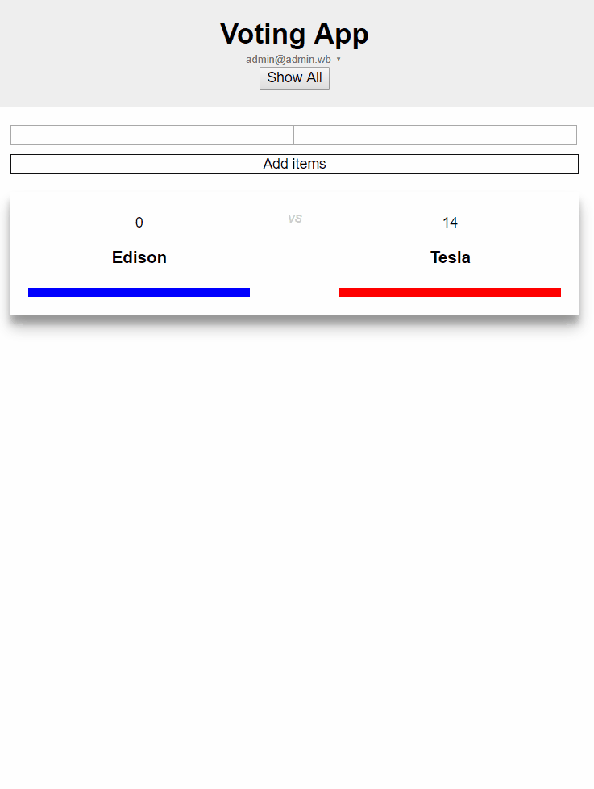

# Voting App

### Meteor + React 15.x
Using Meteor with MongoDB and React for this project. 
Removed *autopublish* and *insecure* packages - using `publications` and `subscriptions`
Using session browser storage. Using withTracker for reactive data.

#### votingApp structure
- client:
    * main.css
    * main.html
    * main.js
- imports:
    - api:
        * items.js - update DB methods
    - client:
        - components: 
            * App.js - `App` and `AppContainer = withTracker(()=> {})`
            * Item.js - single voting poll and its functionality
        - layouts:
           *  MainLayout.js
        - pages:
            * About.js
        - utilities:
            * IsRole.js - stateless component for validating users role
        * routes.js
    - server: 
        * accounts.js - create `admin` user with `Accounts.onCreateUser`
- public:
    * favicon.ico
- server:
    - publications:
        * publications-items.js - publish `Items = new Mongo.Collection`
    * main.js
* package.json

### What can you do
* Log In - email, facebook, twitter, google (oauth)
* Create voting poll
* Add the vote

* Display all polls or display just last one (data sorted by update time)

### votingApp_LUT 
Based on:[LUT](https://www.leveluptutorials.com)